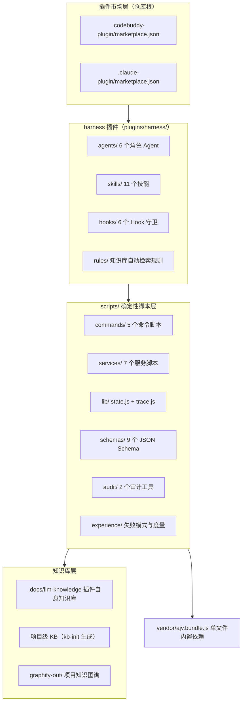
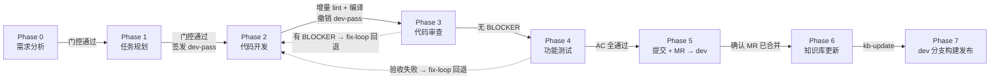

# Harness 插件架构设计技术分析

> **分析对象**：harness-marketplace（Harness Engineering 端到端 AI 开发自动化工作流插件）
> **分析方法**：知识图谱定量分析（graphify v2 构建，2026-09-04：142 文件 → 1824 节点 / 2829 边 / 136 社区）+ 17 份核心文档与脚本 API 文档溯源
> **文档性质**：技术分析报告，所有事实均标注来源文件；推断性结论单独标注【推断】

---

## 目录

1. [系统定位与设计哲学](#1-系统定位与设计哲学)
2. [宏观架构分层](#2-宏观架构分层)
3. [核心运行时：三步编排循环](#3-核心运行时三步编排循环)
4. [8 Phase 工作流状态机](#4-8-phase-工作流状态机)
5. [门控与校验体系](#5-门控与校验体系)
6. [知识库子系统](#6-知识库子系统)
7. [经验沉淀与自进化](#7-经验沉淀与自进化)
8. [质量保障体系](#8-质量保障体系)
9. [知识图谱视角的定量分析](#9-知识图谱视角的定量分析)
10. [设计原则与模式总结](#10-设计原则与模式总结)
11. [技术债与改进建议](#11-技术债与改进建议)
12. [附录](#12-附录)

---

## 1. 系统定位与设计哲学

### 1.1 一句话定位

Harness 是一个安装在 AI 编程助手（Claude Code / CodeBuddy Code）里的**插件市场 + 工作流引擎**，把「Bug 分析 → 需求分析 → 任务规划 → 代码开发 → 代码审查 → 功能测试 → Git 提交 → 知识库更新 → 云端部署」整条研发链路变成一条**程序化调度的状态机流水线**。

（来源：`README.md`、`plugins/harness/plugin.json` v2.0.0）

### 1.2 设计哲学：AI 不操作状态，只机械执行

这是整个架构的第一性原则，贯穿所有模块（来源：`README.md`「核心设计」、`plugins/harness/skills/harness-conductor/SKILL.md`「核心原则」）：

```
┌─ dispatch.js      = 读状态 + 说下一步   （只读，零写权限）      ─┐
│  advance-phase.js = 判门控 + 写状态     （相位跃迁唯一执行者）   │
└─ 主 Agent         = 触发                （无判断权，机械执行）  ─┘
```

由此派生出三条铁律：

| 铁律 | 落地机制 |
|------|---------|
| AI 不直接写/改 `e2e-state.json` / `dev-pass.json` | `writeStateFile()` 是唯一合法写入通道 + `enforce-state-file.js` Hook 拦截 |
| AI 不跳过 Phase | `advance-phase.js` 独立校验入参（范围 0~7、步长必须 +1），`enforce-artifact.js` 检查前置产出物 |
| AI 不自标记 `open-questions.json` resolved | 待确认项必须由用户确认 |

**为什么这样设计**：LLM 的输出具有非确定性，如果让 LLM 参与状态变更或上下文拼装，同一输入在不同轮次会产生不同的执行路径——这是流程失控的直接来源（`Agent-Prompt-单一信源.md`）。因此所有「判断」收敛到确定性脚本，所有「裁量」收敛到单一信源生成器，LLM 只保留「执行」。

### 1.3 触发权 ≠ 决定权

命令由主 Agent 敲，但是否合法由 `advance-phase.js` 独立裁定。主 Agent 传错 targetPhase（越界/跨阶/倒退）会被脚本拒绝，不会写坏状态（`harness-conductor/SKILL.md`）。这是一种典型的**权责分离（separation of powers）**模式在 Agent 编排里的应用。

---

## 2. 宏观架构分层

### 2.1 分层总览



### 2.2 各层职责

| 层 | 位置 | 职责 | 关键事实 |
|----|------|------|---------|
| 市场层 | `.codebuddy-plugin/` `.claude-plugin/` | 双平台插件清单（内容一致），安装源 GitHub `JayCJP/harnessflow` | 适配 Claude Code 与 CodeBuddy Code 相同的 `/plugin` 命令体系 |
| Agent 层 | `plugins/harness/agents/` | 6 个工程角色的行为规范、工具集、MCP 声明 | 通过 frontmatter 声明 `tools` / `agentMode` / `mcpServers`；注册名为英文，文件名中文 |
| Skill 层 | `plugins/harness/skills/` | 11 个技能，**渐进式披露**设计（骨架常驻 + references 按需读取） | 骨架 ~120 行 + references 按动作触发读取，避免常驻 context 浪费 |
| Hook 层 | `plugins/harness/hooks/` | 6 个守卫，注册在 `hooks/hooks.json`，自动运行 | PreToolUse 拦截写操作，PostToolUse 留痕，SessionStart/Stop 断点恢复与收尾 |
| Rule 层 | `plugins/harness/rules/` | `kb-auto-query.md`：需求分析/改代码前自动触发知识库检索 | 双源交叉验证规则的载体 |
| 脚本层 | `plugins/harness/scripts/` | 全部确定性逻辑：状态机、门控、校验、prompt 生成 | commands 5 + services 7 + lib 2 + audit 2，AI 直接调用的只有 commands |
| Schema 层 | `plugins/harness/scripts/schemas/` | 9 个 JSON Schema 契约 | 字段白名单制，Agent 不得添加未声明字段 |
| 经验层 | `plugins/harness/scripts/experience/` | `failure-patterns.json` + `metrics-insights.json` | 教训按 Phase 分类，注入后续 prompt |
| 知识库层 | `.docs/llm-knowledge/` | 插件自身业务的 LLM 知识库 | business（按模块）+ common（通用）+ `meta.yaml` 索引 |
| Vendor 层 | `plugins/harness/vendor/ajv.bundle.js` | 内置 ajv（6 系）单文件 | **免 `npm install`**，错误位置字段为 `dataPath` |

### 2.3 技能清单（11 个）

| Skill | 职责 | 阶段 |
|-------|------|------|
| `harness-start` | 统一入口：识别意图（run / fixbugs），梳理 story-input | 入口 |
| `harness-conductor` | 工作流编排器：三步循环调度 | 全程 |
| `harness-archive` | Story 归档/复档/查看归档历史 | 收尾 |
| `harness-evolve` | 自进化体检：audit → 度量 → 诊断 → 治疗 → 验证 | 治理 |
| `kb-init` | 知识库初始化（骨架与血肉分离） | 项目初始化 |
| `kb-query` | 分层知识库检索 | Phase 0/2 前置 |
| `kb-update` | 知识库增量更新（保留手工批注） | Phase 6 |
| `gen-project-docs` | 文档生成 | 按需 |
| `api-generator` | Swagger/API doc → 接口定义 + 请求函数 | 按需 |
| `figma-to-component-map` | Figma frame 清单 + 组件映射 | 有设计稿时 |
| `tapd-bug-analyzer` | TAPD 缺陷拉取与根因分析 | fixbugs 模式 |

### 2.4 Agent 清单（6 个角色）

| Agent | 注册名 | Phase | 职责 | 关键约束 |
|-------|--------|-------|------|---------|
| 需求分析师 | `requirement-analyst` | 0 | 需求分析、原型/Figma 抓取、验收标准 | fixbugs 模式下自行调 tapd-bug-analyzer |
| 任务规划师 | `task-planner` | 1 | 任务 DAG 拆解 | 依赖识别、Fork-Join 并行 |
| 前端开发工程师 | `frontend-developer` | 2 | 编码 | 有 figmaLink 必须亲自调 Figma MCP 拉完整设计 |
| 代码审查师 | `code-reviewer` | 3 | 审查 | 分级 BLOCKER/WARNING/SUGGESTION |
| 测试工程师 | `test-engineer` | 4 | 验收测试 | 逐条 AC 回归 |
| 发布助手 | `release-assistant` | 5/6/7 | 提交/知识库/部署 | 禁止 `--no-verify` 跳过钩子 |

（来源：`.docs/llm-knowledge/business/agents/overview.md`、`references/phases/README.md`）

### 2.5 外部 MCP 依赖（按需启用）

| MCP 服务 | 使用场景 | 必需程度 |
|---------|---------|---------|
| TAPD MCP | Bug 分析、需求详情 | fixbugs 模式必需 |
| Figma MCP | 设计稿读取、组件映射 | 有设计稿时必需 |
| Playwright MCP | 原型抓取、UI 测试 | 有原型/UI 测试时必需 |
| GitLab MCP | 创建 MR | 走 MR 流程时必需 |
| DevOps MCP | 云端构建部署 | 云端部署时必需 |
| Sequential Thinking MCP | 任务拆解结构化推理 | 建议启用 |

设计要点：插件**不携带**外部 MCP，未配置时相关环节会失败并**如实告知，不会静默跳过**（`README.md`）——这是「诚实性原则」在依赖管理上的体现。

---

## 3. 核心运行时：三步编排循环

### 3.1 三步循环（主控协议）

主 Agent（harness-conductor 骨架）每个循环只做三步，**不读状态、不做判断、不拼 prompt**（来源：`harness-conductor/SKILL.md`「执行流程」）：

```
Step 1: 执行 node ${HARNESS}/dispatch.js <storyId>
        → 输出纯 JSON，含 status / nextAgent / agentPrompt / advanceCommand

Step 2: 按 status 分支（四态互斥且穷尽，无「其他情况自行处理」）
  ┌ ready     → 若 readyToAdvance=true: 先执行 advanceCommand，再回 Step 1
  │             否则: Spawn nextAgent，prompt = agentPrompt（原样注入，不加工）
  ├ fix_loop  → 执行 recovery.command
  ├ blocked   → 按 recovery.description 处理，无 command 则转人工
  └ terminal  → 流程结束，按 recovery 提示收尾

Step 3: 子 Agent 汇报产出物路径 → 回到 Step 1
```

主 Agent 明确禁止的行为：

- 🚫 直接读取 `e2e-state.json`（由 dispatch.js 读取）
- 🚫 自行判断当前 Phase 和下一步调谁（由 dispatch.js 查 `PHASE_AGENTS` 表）
- 🚫 自行处理异常恢复（由 dispatch.js 输出 recovery）
- 🚫 改写 `agentPrompt` 正文或替换其内容

### 3.2 dispatch.js — 只读调度器

输出契约（来源：`references/api/commands.md`）：

| 字段 | 类型 | 说明 |
|------|------|------|
| `status` | `ready` \| `fix_loop` \| `blocked` \| `terminal` | **四态互斥且穷尽**，主 Agent 按此机械分支 |
| `nextAgent` | string \| null | Agent 注册名（英文），原样传给 Spawn |
| `agentLabel` | string \| null | 中文名，仅供展示，**禁止用于 Spawn** |
| `agentPrompt` | string \| null | 完整 prompt，无占位符，原样注入 |
| `advanceCommand` | string \| null | 已算好 targetPhase 的推进命令（绝对路径，运行时动态解析插件根） |
| `readyToAdvance` | boolean | 仅 status=ready 且门控已通过时输出 |
| `expectedOutputs` | string[] | 本 Phase 应产出文件清单，用于校验子 Agent 汇报 |
| `pendingBlockers` | Array | 门控预检未通过时的 blocker 列表（结构化 failureType） |
| `batches` | Array | Phase 2 多批次时输出，每项含 batchId/taskIds/agent/agentPrompt |
| `recovery` | object \| null | `{ type, command, description }`；command 为 null 表示转人工 |
| `warnings` | string[] | 不阻塞的告警，转述给用户但不改变分支 |

**唯一的写例外**（P2-1，2026-09）：预检报出 blocker 时落盘 `.dispatch-precheck.json`（诊断类文件，非状态机文件），供 `advance-phase.js` 推进成功时对账补记 `preGateBlocked` 教训。除此之外 dispatch 绝不写任何文件。

### 3.3 advance-phase.js — 相位跃迁唯一执行者

六种命令形态（来源：`references/api/commands.md`）：

```bash
node $HARNESS/advance-phase.js <storyId> <phase>              # 推进（必须 = currentPhase+1）
node $HARNESS/advance-phase.js <storyId> 2 --renew-pass       # 续签 dev-pass，不推进
node $HARNESS/advance-phase.js <storyId> 3 --lint-fix         # 按 task-dag 仓库逐个 eslint --fix
node $HARNESS/advance-phase.js <storyId> <phase> --auto-fix   # 门控失败先自动恢复再重跑
node $HARNESS/advance-phase.js <storyId> <phase> --rollback   # 回退：归档中间产出物
node $HARNESS/advance-phase.js <storyId> 2 --fix-loop         # 修复回路
HARNESS_RUN_BUILD=1 node $HARNESS/advance-phase.js <id> 3     # 启用本地编译校验
```

**独立校验的入参约束**：targetPhase 范围 0~7、步长必须 +1。越界会写出 `phase: 99` 这类污染状态；跨阶会跳过中间门控与 summary 生成；倒退是 `--rollback` 的职责——主 Agent 传错参数也写不坏状态。

输出只看 `success` 一个字段：`true` → 回 Step 1 重新 dispatch；`false` → `recovery.command` 存在则原样执行后回 Step 1，为 null 则转人工。

三类特殊拒绝：

| 拒绝原因 | 含义 | 处理 |
|---------|------|------|
| targetPhase 非法（越界/跨阶/倒退） | 脚本独立校验入参 | 用 dispatch.js 的 advanceCommand，不要手写 |
| `phase_integrity_violation` | 某 Phase 已标 completed 但 state.phase 仍在其之前 → 判定有人绕过脚本改状态 | 按人工修复指引处理，事件已写入 trace |
| 归档守卫 | Story 已归档，禁止 --rollback / --fix-loop | 先 `archive-story.js <id> restore` 复档 |

### 3.4 prompt-builder.js — Agent Prompt 单一信源

`buildAgentPrompt({ storyId, targetPhase, summaryPhase })` 是**唯一出口**，被 `dispatch.js` 与 `advance-phase.js` 共用同一信源（避免出现两份自称权威的 prompt 来源）。产出已包含：

- Story ID、当前 Phase、上一 Phase 摘要（`phase-N-summary.md`）
- 契约文件内容（AC / task-dag / verification）
- 历史教训（`experience.js:getLessonsForPhase`）
- 约束条款（`AGENT_CONSTRAINTS`）、产出物清单、修复回路上下文
- 按 `mode` 分支注入：fixbugs 时给 Phase 0 注 Bug 分析指引、Phase 2 注「修复方案自行设计」说明
- 自动发现并注入 Story 目录下的 `*bug分析报告.md` 全文

**为什么不允许主 Agent 加工 prompt**（来源：`Agent-Prompt-单一信源.md`）：一旦主 Agent 参与拼接，注入哪些上下文就变成一次自由裁量，不同轮次注入的内容会不一致，Phase 2 的 `files[]` 写入范围也可能被漏掉。prompt 内容需要调整时，改 `prompt-builder.js`，不改主 Agent 行为。

### 3.5 Spawn 前置注入 — 唯一允许的 prompt 加工

`agentPrompt` 正文原样注入，但允许在**正文之前 prepend** 三类信息块（来源：`harness-conductor/SKILL.md`）：

| 前置块 | 内容 | 动机 |
|--------|------|------|
| ① 已验证环境事实块（instinct 级，必须做） | 主 Agent 实测过的环境结论：CLI 可用性、本地限制、文件遗留状态、降级路径、探测预算兜底 | 子 Agent 看不到主 Agent 执行历史，会从零探测环境。实测案例：3 个开发 Agent 因误判 graphify 不可用全部耗尽轮次空转 |
| ② 用户裁决块 | 主 Agent 已向用户确认的决议 | 防止子 Agent 把已裁决项重新当问题上报或擅自改动 |
| ③ 重试说明块 | 上轮失败原因与硬性要求 | 如「上轮未落盘产出物，必须实际落盘」 |

P3-5（2026-09）优化后，跨仓检索入口已由 prompt-builder 生成并注入正文，前置注入仅保留 prompt 未覆盖的实测结论。

### 3.6 状态机与 Reducer 模式

`e2e-state.json` 的变更遵循 **Reducer 模式：LLM 出 Action，纯函数变更 State**（图谱社区「状态机单一信源」的核心概念，源自 `docs/淘宝主播Agent的Harness工程实战-深度研读.md`）。状态写入顺序约定：`writeStateFile` **先于** trace 写入，确保 trace 不会领先于 state；trace 写失败不阻塞流程。

---

## 4. 8 Phase 工作流状态机

### 4.1 Phase 总表

| P | 名称 | Agent 注册名 | 产出物 | 出门门控实现 |
|---|------|-------------|--------|------------|
| 0 | 需求分析 | `requirement-analyst` | `requirement-analysis.md` `acceptance-criteria.json` `open-questions.json`（+`prototype-analysis.md` 条件性） | `checkPhase0Gate` |
| 1 | 任务规划 | `task-planner` | `task-dag.md` `task-dag.json`（+`figma-frame-inventory.json` 条件性） | `checkPhase1Gate` |
| 2 | 代码开发 | `frontend-developer` | 代码变更（git diff） | `checkPhase2Gate`（内部调用，未导出） |
| 3 | 代码审查 | `code-reviewer` | `code-review.json` | `checkPhase3Gate` |
| 4 | 功能测试 | `test-engineer` | `test-report.md` `acceptance-verification.json` | `checkPhase4Gate` |
| 5 | Git 提交 | `release-assistant` | commit + push + MR | 仅产出物存在性 |
| 6 | 知识库更新 | `release-assistant` | meta.yaml 刷新 | 仅产出物存在性 |
| 7 | 云端部署 | `release-assistant` | 部署 URL + 构建号 | 仅产出物存在性 |
| 8 | —（终态） | — | 流程结束 | — |

两个**唯一信源**（来源：`references/phases/README.md`）：

- 产出物清单唯一信源：`lib/state.js` 的 `PHASE_ARTIFACTS`
- Phase→Agent 唯一信源：`lib/state.js` 的 `PHASE_AGENTS`，由 dispatch.js 以 `nextAgent` 输出

### 4.2 横向流转与修复回路



### 4.3 通用三道检查（每个 Phase 出门固定执行）

`runGateCheck(storyId, phaseNum, state)` 在进入 Phase 专属检查前固定跑（来源：`references/phases/README.md`）：

1. **产出物存在性** `checkPhaseArtifact` — 缺失即 BLOCKER（`artifact_missing`, level 4）。`optional: true` 的不因缺失失败；`requiredWhen: 'hasFigmaDesign'` 的按状态位转必需。
2. **JSON Schema 校验** — 按 `schema-validator.js:getPhaseArtifacts(phaseNum)` 逐项校验，不符即 BLOCKER（`schema_validation_failed`, level 2）。**fail-closed，不降级放行**。
3. **资源完整性** `checkResourceIntegrity` — 只在 phaseNum=3 时执行：开发阶段 kb-query / graphify 调用为 0 → WARNING（记 debt，不阻断）。

### 4.4 Story 目录结构

```
<PROJECT_ROOT>/.codebuddy/plans/<storyId>/
├── e2e-state.json          # 工作流状态（phase 唯一信源，仅脚本可写）
├── story-input.json        # 原始输入（mode + sources，由入口 skill 写）
├── repos.json              # 仓库注册表（story 级独立）
├── trace.jsonl             # 全链路审计
├── dev-pass.json           # 开发通行证（仅 Phase 2 存在，脚本自动管理）
├── phase-N-summary.md      # Phase 上下文摘要（脚本自动生成）
├── fix-request.json        # 修复回路请求（--fix-loop 生成）
├── fix-context.md          # 修复回路上下文（--fix-loop 生成）
├── archive/
│   ├── round-{N}/          #   终态归档
│   └── *.archived          #   --rollback / --fix-loop 归档
└── ...                     # 各 Phase 产出物
```

多仓库唯一真实信源 = story 级 `repos.json`（`primary` + `repos` 映射），**不依赖任何宿主环境变量**（`CODEBUDDY_WORKSPACES` / `CLAUDE_WORKSPACES` 均非官方变量）。

### 4.5 恢复级别体系

blocker 的 `level` 决定恢复策略，由 `policy.js` 判定，**主 Agent 不参与选择**（来源：`错误恢复.md`、`references/phases/README.md`）：

| level | 策略 |
|-------|------|
| 1 | 自动修复 |
| 2 | 提示修复 |
| 3 | 降级 |
| 4 | 人工 |

未登记的 failureType 命中 `RECOVERY_SUGGESTIONS.unknown`（level 3）并产生 warning，提示补录为独立条目——**见到这个 warning 就该往 `RECOVERY_SUGGESTIONS` 加条目**，这是经验库的入口之一。

### 4.6 fix-loop 修复回路

- 触发：审查（Phase 3）发现 BLOCKER 或测试（Phase 4）验收失败
- 动作：回退到 Phase 2 修复，重新签发限域到 `affectedFiles` 的 dev-pass
- 预算：review 与 test **各 2 轮独立预算**（`DEFAULT_MAX_REVIEW_FIX_ROUNDS` / `DEFAULT_MAX_TEST_FIX_ROUNDS`）
- 用尽后：`dispatch.js` 输出 `status: blocked` 且 `recovery.command` 为 null → 转人工。**不要让 AI 无限重试空转。**

### 4.7 dev-pass 生命周期（权限控制核心）

```
Phase 1→2: 脚本自动签发（限域到 task-dag.json 的 files[]）
Phase 2→3: 脚本自动撤销（主撤销点）
Phase 4→5: 脚本自动兜底撤销（防 fix-loop 残留，幂等）
```

三重校验（`enforce-dev-pass.js`）：**有效性**（存在且未过期，TTL 2h）+ **路径限域**（目标文件必须在 `files[]` 派生白名单内）+ **Phase 校验**（必须 Phase 2）。总开关是 `.codebuddy/plans/.harness-active` 标记文件——有标记才校验，无标记直接放行。

### 4.8 run vs fixbugs 双模式

| 维度 | run（新功能） | fixbugs（缺陷修复） |
|------|--------------|-------------------|
| 原型文档 | 必需（无原型纯文字需求会被卡） | 免除 |
| Figma 硬门控 | 自动开启（给了 figmaUrls 即强制） | 不开启（只碰个别页面，全量清单会卡死修复流程） |
| Phase 0 产出 | requirement-analysis.md | Bug 分析报告（自动拉 TAPD 缺陷） |
| 后端类 Bug | — | 自动转 open-questions |
| 功能点 | featurePoints 功能点枚举 | — |

`getStoryMode(storyId)` 的回退链：`story-input.json` 的 `mode` → `e2e-state.json` 的 `mode` → 都没有则 `'run'`。**无 story-input.json 时 `isPrototypeRequired` 保守返回 true**（fail-closed）。

---

## 5. 门控与校验体系

### 5.1 policy.js — 风险门控层

```js
runGateCheck(storyId, phaseNum, state) → { passed, blockers[], warnings[], recoveries[], _meta }
```

- `phaseNum` 是**当前**（来源）Phase，判定「能否离开它」
- 每个 blocker 是结构化对象 `{ type, message, level, resolution }`，`type` 即 failureType，供 `experience.js` 直接沉淀，无需从文本反推

「改哪里影响什么」速查（来源：`references/api/services.md`）：

| 想改的东西 | 改这个文件 |
|-----------|-----------|
| Agent prompt 内容 / 注入哪些上下文 | `prompt-builder.js` |
| 加一道门控、改门控级别、改恢复建议 | `policy.js` |
| Phase summary 收集哪些产出物 | `context-refresh.js` |
| 新增 JSON 契约的 schema 校验 | `schema-validator.js` + `schemas/` |
| 失败模式如何沉淀、教训如何注入 | `experience.js` |

### 5.2 九大 JSON Schema 契约

| Schema 文件 | 对应产出物 | 关键字段 |
|------------|-----------|---------|
| `acceptance-criteria.schema.json` | acceptance-criteria.json | id/title/given/when/then/figmaNodeId/testType |
| `acceptance-verification.schema.json` | acceptance-verification.json | results 数组 |
| `code-review.schema.json` | code-review.json | issues 数组（severity/status） |
| `e2e-state.schema.json` | e2e-state.json | gateChecks/phase 状态 |
| `fix-request.schema.json` | fix-request.json | 修复请求 |
| `fix-verification.schema.json` | fix-verification.json | 修复验证 |
| `open-questions.schema.json` | open-questions.json | questions 数组 |
| `story-input.schema.json` | story-input.json | sources（prototypeUrls/figmaUrls） |
| `task-dag.schema.json` | task-dag.json | tasks 数组（figmaLink） |

关键设计：

- **字段白名单制**：Agent 不得添加 schema 未声明的字段
- **两个校验入口语义不同**：`validateArtifact`（Story 目录 + 固定文件名，文件不存在视为 valid，存在性归 `checkPhaseArtifact`）vs `validateFile`（任意路径，不存在即 invalid）
- `getPhaseArtifacts(phaseNum)` 是**硬编码表**，与 `SCHEMA_MAP` 解耦——往 SCHEMA_MAP 注册新 schema **不会自动**让门控开始校验它
- Ajv 来自 `vendor/ajv.bundle.js`（6 系），不依赖 node_modules

### 5.3 六个 Hook 守卫

| Hook | 事件 | matcher | 超时 | 职责 |
|------|------|---------|------|------|
| `session-start.js` | SessionStart | — | 30s | 断点恢复：恢复断点 + 加载最近 summary + 注入历史教训 + 输出契约清单 |
| `enforce-state-file.js` | PreToolUse | write/edit/patch/**Bash** | 5s | 拦截对 `e2e-state.json` / `dev-pass.json` 的一切写操作（**含 shell 重定向绕过**） |
| `enforce-dev-pass.js` | PreToolUse | write/edit/patch | 10s | src/ 编辑三重校验（有效性 + 限域 + Phase） |
| `enforce-artifact.js` | PreToolUse | 同上 | 10s | 防跳 Phase：检查前置产出物存在 |
| `trace-command.js` | PostToolUse | 命令/Agent/Skill/MCP | 5s | 命令留痕写 trace.jsonl |
| `session-stop.js` | Stop | — | 10s | 清理过期 dev-pass + Hook 拒绝事件沉淀为经验（`recordHookFailure`） |

**闭环设计**：被 hook 拒绝不只是当场失败，它通过 `session-stop.js` 沉淀到经验库，变成下次的注入教训。

### 5.4 增量 lint 与本地编译门控（Phase 2→3）

| 检查 | 级别 | failureType |
|------|------|-------------|
| 变更文件（.js/.jsx/.ts/.tsx/.vue）存在 lint error | BLOCKER (2) | `lint_error` |
| 本地编译失败（仅当 `HARNESS_RUN_BUILD=1`） | BLOCKER (2) | `build_failed` |
| repos.json 仓库路径不存在 / 找不到 eslint / 未检测到变更 / 编译校验关闭 | WARNING | — |

两个刻意取舍（来源：`references/phases/phase-2.md`）：

- **只 lint `git status --porcelain` 变更文件**：不让仓库存量 lint 债永久卡住门控
- **用 `npx eslint` 而非 `npm run lint`**：保证门控绝不会 `--fix` 改动代码
- **编译校验默认关闭**：构建无法增量（上限 900s），且 fix-loop 每轮回退都会再触发全量构建——流程阻塞主因。代价：SCSS/模板编译错误只能到 Phase 7 云端构建才暴露（历史案例：SCSS `/deep/ ... ::after` 编译错误逃过全部本地门控）

### 5.5 状态文件防篡改三道防线

1. `enforce-state-file.js` Hook 拦截直接写（含 Bash 绕过）
2. `writeStateFile()` 单一合法写入通道
3. `phase_integrity_violation` 检测：某 Phase 已标 completed 但 `state.phase` 仍在其之前 → 判定绕过脚本改状态，事件写入 trace

---

## 6. 知识库子系统

### 6.1 四类载体协同

知识以四类载体注入工作流（图谱超边「知识库四类载体协同」）：

| 载体 | 位置 | 注入时机 |
|------|------|---------|
| rules | `rules/kb-auto-query.md` | 需求分析/改代码前自动触发检索 |
| skill | kb-init / kb-query / kb-update | 显式调用 |
| agent | 各 Agent 文档内嵌「知识库集成」章节 | Spawn 时 |
| command | prompt-builder 注入历史教训 | 每次 prompt 构建 |

### 6.2 插件自身知识库（.docs/llm-knowledge/）

```
.docs/llm-knowledge/
├── meta.yaml              # 知识库索引
├── .profile.yaml          # 项目画像（project_type/source_root/domain_axis）
├── overview.md            # 总览
├── business/              # 按模块的业务知识
│   ├── agents/            # 6 Agent 角色规范（overview + custom）
│   ├── commands/          # 命令模块（已迁移为 Skill）
│   ├── experience/        # 失败模式与度量
│   ├── schemas/           # JSON Schema 契约
│   ├── scripts-commands/  # 命令脚本
│   ├── scripts-core/      # 核心逻辑（lib + services）
│   ├── scripts-hooks/     # 钩子脚本
│   └── skills/            # 技能模块
└── common/                # 通用知识（conventions / lib_usage / tech）
```

### 6.3 kb-init：骨架与血肉分离

知识库模板**不是**静态填充，而是「统一概念框架（骨架）+ 项目实际动态生成（血肉）」（来源：`docs/KB_SKILL_重构_设计方案.md`）。模板族：

- common 六切面：overview / architecture / config / conventions / pitfalls / log
- frontend 三件：api / pages / store
- plugin 三件：commands / entry-files / schemas

初始化时自动推断**项目画像**（`.profile.yaml`：project_type / source_root / domain_axis），后续检索按画像路由。

### 6.4 双源交叉检索（kb-query ∥ graphify）

标准代码检索流程（来源：`references/代码检索规范.md`）：

```
1. kb-query  — 业务语义层：按功能模块/接口名检索，拿业务语义、候选文件、历史踩坑
2. graphify  — 结构层：query "<关键词>" 拿结构视图，explain "<模块>" 理解职责，
              path "<API>" "<渲染出口>" 追调用链
3. 双源交叉验证收敛
4. search_content / search_file 兜底：仅当两路都没定位到时使用
```

禁止：仅用 Explore agent 或仅文本搜索定位代码；跳过 kb-query / graphify 直接猜文件路径。

该模式已被多个 Skill 统一采用（图谱超边 INFERRED 0.85）：conductor 的代码检索规范与 tapd-bug-analyzer 的代码定位都遵循双源交叉验证。

### 6.5 kb-update：增量更新

流程（图谱超边）：脚本提取变更 → AI 保留批注更新文档 → 更新索引 → 迁移原型设计文档。核心约束是**保留手工批注**，避免每次全量重写。

### 6.6 知识库新鲜度检测

三级新鲜度分级（fresh / stale / critical + 阈值派发）（来源：`docs/KB_FRESHNESS_新鲜度检测_设计方案.md`），与信任度衰减机制配合，防止过期知识污染决策。

---

## 7. 经验沉淀与自进化

### 7.1 经验飞轮（experience.js）

两个方向形成闭环：

```
门控失败 → recordFailurePattern 记录（failureType 结构化沉淀）
                ↓
失败模式库 failure-patterns.json（按 Phase 分类）
                ↓
构造 prompt 时 getLessonsForPhase 注入 → 下一轮次 Agent 带着教训执行
```

附加入口：`session-stop.js` 把 Hook 拒绝事件通过 `recordHookFailure` 沉淀；`dispatch.js` 预检 blocker 由 advance-phase 对账补记为 `preGateBlocked` 教训。

经验三级演化路径（图谱概念）：**lesson（教训）→ pattern（模式）→ instinct（本能）**。

### 7.2 trace.jsonl 全链路审计

```js
{ appendTrace, traceAgentSpawn, traceAgentResult, traceToolCall, traceAgentMessage,
  traceGitEvent, traceGateDecision, tracePhaseTransition, traceErrorRecovery, traceExperience }
```

供调试/审计/经验沉淀三用。`checkResourceIntegrity` 读它判断开发阶段是否真的调用过 kb-query / graphify。

**已知盲区**：子 Agent 的 tool_call 不会写进主流程的 trace.jsonl——这是 Figma MCP 消费检查被移除、kb-query 检查只给 WARNING 不给 BLOCKER 的原因。

### 7.3 harness-evolve 自进化五步闭环

```
体检(audit) → 度量(metrics) → 诊断(mining) → 治疗(proposal) → 验证(verify)
```

（来源：`plugins/harness/skills/harness-evolve/SKILL.md`）治疗的目标物是 agents/*.md / policy.js / advance-phase.js / schemas/——即**自进化的对象是 harness 自身的规则与配置**。

### 7.4 度量体系

- `metrics-aggregator.js`：Phase 7 完成时由 advance-phase 自动触发，聚合 phase 时长等指标
- 五维洞察产出（`loop-insights.json`）：诚实性（observed/inferred/unobserved）是核心原则——**证据不足则不打分**
- `mustCheck` 强制转化清单：教训 → 可验证检查项（EVOLVE_RESOURCE_USAGE 方案）
- 时间戳前置校验（Temporal Check：TOO_LATE/MISSING/CONSUMED）与产物特征指纹（查影响而非查调用）构成 trace 证据链

### 7.5 演进方向：声明式 DAG 工作流引擎

图谱超边（EXTRACTED 1.00）揭示了 `docs/DYNAMIC_WORKFLOW 动态可编排工作流设计方案`（已删除的文档，仍保留在图中）的技术路线：

- WFD 工作流定义（`harness://workflow/v1`）
- `wf-graph.js` 图运行时 + `wf-lint.js` 静态检查
- `GATE_REGISTRY` 门控注册表 + `EFFECT_REGISTRY` 副作用注册表
- 调研对象：Temporal / Airflow / Prefect / Dagster / Argo Workflows / Dapr Workflow / Apache Seata Saga / 社区动态工作流实践
- 反面教材结论：**不要让模型直接生成编排脚本**

【推断】该方向与现行硬编码 8 Phase 的张力，是「稳定性 vs 灵活性」的典型权衡，目前仓库选择了稳定性优先。

---

## 8. 质量保障体系

### 8.1 测试矩阵（scripts/__tests__/）

| 测试文件 | 覆盖范围 |
|---------|---------|
| `flow-regression.test.js` | 端到端流程回归（phase 推进序列） |
| `fixbugs-regression.test.js` | fixbugs 模式回归 |
| `optimization-regression.test.js` | 优化项回归（2026-09 新增，43 个节点，本次构建新入图） |
| `story-input-ingest.test.js` | story-input 摄取（--input 校验） |
| `figma-detection.test.js` | Figma 来源检测 |
| `experience-lessons.test.js` | 经验教训注入 |
| `run-all.js` | 测试入口（spawnSync 串行执行） |

### 8.2 审计工具（scripts/audit/）

- `harness-audit.js`：检查 settings.json / e2e-state / 产出物完整性——排查「流程行为不符预期」先跑它（图谱中独立成 53 节点社区，audit* 函数族完整）
- `metrics-aggregator.js`：指标聚合 + Phase 时长计算 + 洞察生成

### 8.3 结构化错误体系

`structuredError(type, message, level, resolution)` 统一构造 blocker；错误码分段（3xxx/4xxx/5xxx/9xxx + 重试策略绑定）的设计在 State 结构化错误社区中被提取为概念节点。

---

## 9. 知识图谱视角的定量分析

> 本节基于 graphify v2 构建（2026-09-04）：142 文件（57 代码 + 85 文档，~125,767 词）→ **1824 节点 / 2829 边 / 136 社区**。抽取方式：AST 结构抽取（1497 节点/2426 边）+ 语义抽取（341 节点/732 边，其中 73 节点来自缓存复用）。

### 9.1 God Nodes：核心抽象是 state.js 函数群

| # | 节点 | 边数 | 解读 |
|---|------|------|------|
| 1 | `getStoryDir()` | 37 | Story 目录定位被全线复用（commands/services/hooks） |
| 2 | `readStateFile()` | 33 | 状态读取唯一入口 |
| 3 | `harness-conductor SKILL` | 24 | 编排器骨架是文档层最大枢纽 |
| 4 | `loadRepos()` | 21 | 多仓库注册表读取 |
| 5 | `kb-init 知识库初始化 Skill` | 21 | KB 子系统的中心 |
| 6 | `buildAgentPrompt()` | 19 | prompt 单一信源的出口 |
| 7 | `readJsonArtifact()` | 18 | 契约文件读取 |
| 8 | `services API 文档` | 18 | API 文档被大量引用 |
| 9 | `getPhaseName()` | 17 | Phase 常量出口 |
| 10 | `validateGate()` | 17 | 门控校验 |

**结论**：God Nodes 前 10 中 7 个是 `lib/state.js` 的函数——**`state.js` 是事实上架构重心**，这与其「唯一信源」设计定位完全一致。改它影响面最大（`references/api/lib.md` 明示）。

### 9.2 社区结构：136 个社区的构成

社区分布揭示了两类截然不同的凝聚体：

**A. 功能社区（~40 个，节点多、语义强）**——按运行时职责聚类：

| 社区 | 规模 | 内容 |
|------|------|------|
| Dispatch 调度与门控 | 73 | dispatch.js / advance-phase / buildAgentPrompt / toPosix 等 |
| 自进化机制设计 | 58 | EVOLVE 方案 / mustCheck / 时间戳校验 / trace 证据链 / LCS 重复识别 |
| Ajv RFC 格式校验 | 57 | vendor 内嵌 RFC 格式校验 |
| Harness 审计 | 53 | harness-audit.js audit* 函数族 |
| Phase 门控与恢复策略 | 43 | checkResourceIntegrity / policy.js / attemptAutoRecovery |
| 优化回归测试 | 43 | optimization-regression.test.js |
| 知识库设计方案 | 42 | KB_FRESHNESS / KB_SKILL / REAL_RUN 等设计文档 |
| Dev-Pass 钩子 | 42 | enforce-dev-pass.js |
| 工作流创建 | 35 | create-workflow.js |
| 状态机单一信源 | 34 | Reducer 模式 / advance-phase.js |
| 知识库技能族 | 31 | kb-init / kb-query / kb-update / gen-docs / Phase 6 |
| 工作流引擎调研 | 17 | Temporal / Argo / Dapr 等 |

**B. Schema 碎片社区（~90 个，3~47 节点）**——AST 把每个 JSON Schema 的关键字（type/pattern/minLength…）抽取为节点，聚成大量微型社区（如「Story 状态枚举」「严重级别枚举」「行号字段」）。【推断】这反映 schema 文件内部是强连通星形结构（字段→关键字），文件之间几乎无连接——契约之间靠 `validateContractReferences` 运行时交叉校验而非静态结构关联，图谱因此无法把它们连起来。

### 9.3 超边揭示的群体关系（精选）

| 超边 | 置信度 | 揭示的结构 |
|------|--------|-----------|
| 8 Phase 工作流主链路（6 Agent + 调度脚本 + task-dag） | EXTRACTED 1.00 | 主流水线的完整参与者清单 |
| Conductor 三步编排循环（dispatch 四态 → advance-phase 门控 → prompt-builder 注入 → Spawn 前置注入） | EXTRACTED 1.00 | 编排核心的四件套耦合 |
| 修复回路参与方（--fix-loop 编排 / policy 判定 / dispatch 输出 / dev-pass 重签） | EXTRACTED 1.00 | fix-loop 横跨 4 个模块 |
| kb-query ∥ graphify 双源交叉检索模式（5 Agent + 自动规则） | EXTRACTED 1.00 | 检索规范渗透到所有 Agent |
| 知识库生命周期技能族（init→填充→update→query） | EXTRACTED 1.00 | KB 四技能闭环 |
| hooks.json 钩子注册机制（6 hooks） | EXTRACTED 1.00 | 钩子全家族 |
| mode 单一驱动机制（run/fixbugs 行为差异） | EXTRACTED 1.00 | 双模式由 story-input 一路派发 |
| 声明式 DAG 工作流引擎（WFD + 图算法 + 注册表 + 双脚本） | EXTRACTED 1.00 | 已删除的 DYNAMIC_WORKFLOW 方案残影 |
| llm-knowledge 知识库生命周期 | INFERRED 0.85 | KB 技能与知识库的关联 |

### 9.4 桥接节点：Phase 0 是全图最强跨社区桥

| 节点 | 介数中心性 | 连接的社区 |
|------|-----------|-----------|
| Phase 0 — 需求分析 | **0.097** | Phase 门控策略 ↔ Dispatch 调度、核心库配置、Harness 审计、工作流创建、Open-Questions Schema、知识库技能族、AC Schema（8 个社区） |
| Phase 4 — 功能测试 | 0.060 | 门控策略 ↔ 核心库配置、Acceptance-Verification Schema |
| Phase 1 — 任务规划 | 0.057 | 核心库配置 ↔ 审计、State 错误、状态机、Task-DAG Schema |

**解读**：需求分析阶段天然是「输入收敛点」——它同时消费 story-input、产出 AC/open-questions（Schema 契约）、触发 KB 检索、决定 fixbugs 路径。架构上它是最值得投入稳健性的单点。

### 9.5 内聚度警告

三个大社区内聚度 < 0.06（图谱建议问题「Should X be split into smaller modules?」）：

| 社区 | 内聚度 | 分析 |
|------|--------|------|
| Ajv RFC 格式校验 | 0.041 | vendor 第三方代码，天然松散，**无需治理** |
| Dispatch 调度与门控 | 0.050 | dispatch.js + advance-phase.js + prompt-builder.js 三个文件被聚成一团——【推断】社区检测把「协作频繁」误判为「应该拆分」；三权分立是刻意设计，不建议拆 |
| 自进化机制设计 | 0.054 | 设计方案文档群（EVOLVE 系列）主题相关但相互独立——文档集天然如此 |

### 9.6 图健康警告

- **180 条悬空端点边**：语义抽取中跨块引用的概念节点未被创建（子代理 A 引用了子代理 B 未产出的节点 ID）。图仍可用，但存在不完整风险
- **141/149 条平行边合并**：同节点对的 calls + imports 被无向图合并（如 advance-phase → state 同时有 calls 和 imports），属正常多关系折叠
- **857 个弱连接节点**：大量 Schema 关键字节点只有 1-2 条边（「name/version/description」这类通用字段）——文档缺口或缺失边的信号，实质是 Schema 碎片社区的另一面

---

## 10. 设计原则与模式总结

| 原则 | 落地 | 来源 |
|------|------|------|
| **单一信源（Single Source of Truth）** | PHASE_ARTIFACTS / PHASE_AGENTS / agentPrompt / writeStateFile / repos.json / prompt-builder 唯一出口 | state.js、Agent-Prompt-单一信源.md |
| **三权分立** | dispatch（读）/ advance-phase（写）/ 主 Agent（触发），触发权 ≠ 决定权 | conductor SKILL |
| **Reducer 状态模式** | LLM 出 Action，纯函数变更 State | 淘宝主播研读 |
| **渐进式披露** | SKILL 骨架常驻 + references 按动作触发读取；「不要整目录通读」 | conductor SKILL、phases/README |
| **fail-closed** | schema 校验失败即 BLOCKER 不降级；无 story-input 时保守要求原型；--input 校验不过不写标记文件 | phases/README、lib.md |
| **结构化契约优先** | 九大 JSON Schema + 字段白名单 + 结构化 blocker（failureType 直接沉淀） | schemas、policy.js |
| **诚实性原则** | observed / inferred / unobserved 三态，证据不足不打分；MCP 未配置如实告知不静默跳过 | metrics 洞察、README |
| **经验飞轮** | 失败 → 结构化沉淀 → 按相位注入 → mustCheck 强制转化 | experience.js、EVOLVE 方案 |
| **确定性优先** | LLM 只执行不判断；判断收敛到脚本；npx eslint 保证门控不 --fix | 全局 |
| **增量与幂等** | 增量 lint / 增量 KB 更新保留批注 / 兜底撤销幂等 / fix-loop 独立预算 | phase-2、kb-update |

---

## 11. 技术债与改进建议

| # | 技术债 | 影响 | 建议 |
|---|--------|------|------|
| 1 | 本地编译门控默认关闭（HARNESS_RUN_BUILD=1 才启用） | SCSS/模板编译错误逃到 Phase 7 云端才暴露（已有历史案例） | 项目内补更快的 `build:dev` script，门控自动优先选它 |
| 2 | 子 Agent tool_call 不写主流程 trace | Figma MCP 消费检查无法做；kb-query 检查只能 WARNING | 【推断】在 Spawn 前置注入中要求子 Agent 自报调用清单，或扩展 trace 管道 |
| 3 | `validate-phase-gate.js` 已废弃仍保留 | 误导读者以为有两套门控 | 删除或移入 attic（历史遗留文档已声明生效门控是 policy.js） |
| 4 | 图谱 180 条悬空端点边 | 语义检索可能漏路径 | 语义抽取时允许「引用外部概念但无法创建」的节点补建占位 |
| 5 | Dispatch 社区内聚度 0.050 | 图谱导航时该社区过大（73 节点）不易聚焦 | 无需拆代码；可在 graphify 层提高分辨率参数 |
| 6 | ajv vendor 为 6 系（dataPath 而非 instancePath） | 与新版 ajv 生态的报错格式不一致 | 保持现状（免 npm install 是刻意选择），升级时注意错误字段名 |
| 7 | Schema 契约间静态无关联 | 图谱分裂出 ~90 个碎片社区；契约交叉校验只发生在运行时 | 【推断】可在 schema 目录加 index 文档描述契约关系，改善图谱与人的导航 |
| 8 | 6 个空 custom README 未产出图谱节点 | KB 自定义目录的说明缺位 | 补充内容后运行 `graphify update .`（manifest 已自动标记重排） |

---

## 12. 附录

### 附录 A：命令速查

```bash
HARNESS=${CLAUDE_PLUGIN_ROOT}/scripts/commands

# 调度与推进（主控循环）
node $HARNESS/dispatch.js <storyId>                     # 只读调度，输出四态 + agentPrompt
node $HARNESS/advance-phase.js <storyId> <phase>        # 推进（必须 currentPhase+1）

# 建流与模式
node $HARNESS/harness-workflow.js start <storyId> "<标题>" [--mode=run|fixbugs] [--input <file>]
node $HARNESS/create-workflow.js <storyId> --refresh-input   # 回填原型/Figma 判定

# 修复与回退
node $HARNESS/advance-phase.js <storyId> 2 --fix-loop
node $HARNESS/advance-phase.js <storyId> <phase> --rollback
node $HARNESS/advance-phase.js <storyId> 2 --renew-pass
node $HARNESS/advance-phase.js <storyId> 3 --lint-fix

# 归档
node $HARNESS/archive-story.js <storyId> archive|restore|list|status

# 审计（手动）
node ${CLAUDE_PLUGIN_ROOT}/scripts/audit/harness-audit.js
node ${CLAUDE_PLUGIN_ROOT}/scripts/audit/metrics-aggregator.js
```

### 附录 B：skills 目录入口技能链

```
/harness start  → harness-start（识别意图）→ harness-conductor（三步循环，全程）
/harness evolve → harness-evolve（五步闭环）
/harness archive → harness-archive
```

### 附录 C：核心文件索引

| 文件 | 角色 |
|------|------|
| `plugins/harness/scripts/lib/state.js` | 状态/常量/契约读取唯一信源（God Nodes 产出地） |
| `plugins/harness/scripts/lib/trace.js` | 全链路审计 |
| `plugins/harness/scripts/commands/dispatch.js` | 只读调度器 |
| `plugins/harness/scripts/commands/advance-phase.js` | 相位跃迁唯一执行者 |
| `plugins/harness/scripts/services/prompt-builder.js` | Agent Prompt 唯一信源 |
| `plugins/harness/scripts/services/policy.js` | 风险门控层 |
| `plugins/harness/scripts/services/schema-validator.js` | JSON 契约校验（fail-closed） |
| `plugins/harness/scripts/services/experience.js` | 经验沉淀飞轮 |
| `plugins/harness/scripts/services/context-refresh.js` | 上下文刷新 + 运行时取证 |
| `plugins/harness/hooks/hooks.json` | 6 个 Hook 守卫注册 |
| `plugins/harness/skills/harness-conductor/SKILL.md` | 编排器骨架（渐进式披露范本） |

### 附录 D：图谱 136 社区标签全表

| ID | 标签 | 规模 | ID | 标签 | 规模 |
|----|------|------|----|------|------|
| 0 | Dispatch 调度与门控 | 73 | 68 | 来源标识字段 | 9 |
| 1 | 自进化机制设计 | 58 | 69 | Acceptance-Verification Schema | 9 |
| 2 | Ajv RFC 格式校验 | 57 | 70 | 测试统计字段 | 9 |
| 3 | Harness 审计 | 53 | 71 | 审查记录字段 | 9 |
| 4 | Schema 校验关键字 | 47 | 72 | E2E-State Schema | 9 |
| 5 | Phase 门控与恢复策略 | 43 | 73 | 状态历史字段 | 9 |
| 6 | 优化回归测试 | 43 | 74 | 严重度字段 | 9 |
| 7 | 知识库设计方案 | 42 | 75 | 状态字段 | 9 |
| 8 | Dev-Pass 钩子 | 42 | 76 | Story-Input Schema | 9 |
| 9 | 工作流创建 | 35 | 77 | Ajv 路径转义 | 9 |
| 10 | Open-Questions Schema | 35 | 78 | 自进化图运行时 | 8 |
| 11 | 状态机单一信源 | 34 | 79 | Acceptance-Criteria Schema | 8 |
| 12 | Fixbugs 回归测试 | 33 | 80 | AC 结构字段 | 8 |
| 13 | 流程回归测试 | 32 | 81 | 测试类型字段 | 8 |
| 14 | API 生成器 | 32 | 82 | 证据类型字段 | 8 |
| 15 | 知识库技能族 | 31 | 83 | Story 状态枚举 | 8 |
| 16 | KB 初始化脚本 | 31 | 84 | 影响文件字段 | 8 |
| 17 | Figma 检测测试 | 30 | 85 | Task-DAG Schema | 8 |
| 18 | State 结构化错误 | 28 | 86 | 通用知识库文档 | 7 |
| 19 | Schema 通用约束 | 23 | 87 | 五维工作循环 | 7 |
| 20 | 上下文刷新 | 21 | 88 | 相位跃迁与防篡改 | 7 |
| 21 | Ajv URI 规范化 | 21 | 89 | 汇总计数字段 | 7 |
| 22 | Story 归档 | 20 | 90 | 修复请求轮次字段 | 7 |
| 23 | 会话停止钩子 | 20 | 91 | 仓库注册字段 | 6 |
| 24 | 度量聚合 | 19 | 92 | 证据长度字段 | 6 |
| 25 | Schema 校验器 | 19 | 93 | Fix-Request Schema | 6 |
| 26 | Ajv 编译核心 | 19 | 94 | 审查来源枚举 | 6 |
| 27 | 输入摄取测试 | 18 | 95 | Story 模式枚举 | 6 |
| 28 | 工作流引擎调研 | 17 | 96 | 复杂度枚举 | 6 |
| 29 | 修复验证结果字段 | 17 | 97 | 任务标题字段 | 6 |
| 30 | Agent 角色文档 | 16 | 98 | 文件列表字段 | 6 |
| 31 | Figma 来源字段 | 16 | 99 | 仓库路径字段 | 6 |
| 32 | KB 更新脚本 | 16 | 100 | 测试入口 Run-All | 6 |
| 33 | Ajv Schema 管理 | 16 | 101 | 调度与提示生成 | 5 |
| 34 | 核心库与阶段配置 | 15 | 102 | AC 关联字段 | 5 |
| 35 | 门控标志字段 | 15 | 103 | 覆盖状态字段 | 5 |
| 36 | 审查结果字段 | 15 | 104 | 审查轮次上限字段 | 5 |
| 37 | 经验沉淀测试 | 15 | 105 | 测试轮次上限字段 | 5 |
| 38 | 文档生成脚本 | 15 | 106 | 验证来源枚举 | 5 |
| 39 | Ajv 引用解析 | 14 | 107 | 严重级别枚举 | 5 |
| 40 | Skill 定义文档 | 13 | 108 | Swagger 解析细节 | 5 |
| 41 | AC 验证统计字段 | 13 | 109 | 延期原因字段 | 4 |
| 42 | 修复统计字段 | 13 | 110 | 来源字段约束 | 4 |
| 43 | 命令与输入文档 | 12 | 111 | Phase 范围字段 | 4 |
| 44 | 核心脚本文档 | 12 | 112 | Phase 上限字段 | 4 |
| 45 | 产物强制钩子 | 12 | 113 | 影响文件条目 | 4 |
| 46 | 验收标准条目字段 | 12 | 114 | 行号字段 | 4 |
| 47 | 任务批次字段 | 12 | 115 | 最大轮次字段 | 4 |
| 48 | 修复请求字段 | 12 | 116 | 来源阶段字段 | 4 |
| 49 | Ajv 异步编译 | 12 | 117 | 描述字段 | 3 |
| 50 | 前端 Agent 与经验 | 11 | 118 | 修复轮次约束 | 3 |
| 51 | 度量洞察原则 | 11 | 119 | Story ID 字段 | 3 |
| 52 | 包描述文件 | 11 | 120 | 问题总数字段 | 3 |
| 53 | 契约校验 | 11 | 121 | 文档字段 | 3 |
| 54 | 审查问题字段 | 11 | 122 | TAPD 链接字段 | 3 |
| 55 | 指纹约束字段 | 11 | 123 | 终态字段 | 3 |
| 56 | 度量记录字段 | 11 | 124 | 文本字段 | 3 |
| 57 | 待确认问题字段 | 10 | 125 | 工作区字段 | 3 |
| 58 | Code-Review Schema | 10 | 126 | 失败类型字段 | 3 |
| 59 | 问题计数字段 | 10 | 127 | 指纹字段 | 3 |
| 60 | Issue 条目字段 | 10 | 128 | ID 模式字段 | 3 |
| 61 | 修复轮次时间字段 | 10 | 129 | 出现次数字段 | 3 |
| 62 | Fix-Verification Schema | 10 | 130 | Ajv 计数工具 | 3 |
| 63 | 原型链接字段 | 10 | 131 | 输出风格规则 | 2 |
| 64 | TAPD 过滤字段 | 10 | 132 | AI URL 模板变量 | 1 |
| 65 | 任务 AC 关联字段 | 10 | 133 | Ajv Clear 方法 | 1 |
| 66 | 证据引用字段 | 10 | 134 | Ajv Get 方法 | 1 |
| 67 | 钩子模块文档 | 9 | 135 | Ajv Put 方法 | 1 |

---

*报告生成：2026-09-04 · 基于知识图谱 graphify v2（1824 节点）与仓库文档 · 图谱数据：`graphify-out/graph.json`，完整审计报告：`graphify-out/GRAPH_REPORT.md`*
