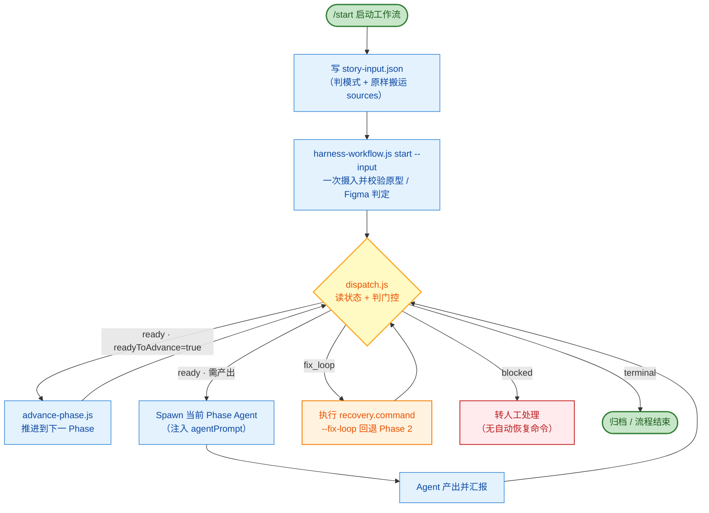

# Harness Marketplace

**端到端 AI 开发自动化工作流插件市场。**

通过安装 **Harness** 插件（v2.0.0），为你的 AI 编程助手（Claude Code / CodeBuddy Code）接入一条覆盖「需求分析 → 任务规划 → 代码开发 → 代码审查 → Git 提交 → 知识库更新 → 云端部署」全流程的自动化开发流水线（run / fixbugs 双模式），并配套 12 个 Skill：工作流编排（start / end / archive / evolve）、知识库（KB）管理、原型与设计稿采集、API 生成等能力。

> **快速上手只有一对 Skill：`/start` 启动 → `/end` 收尾。** 中间各 Phase 由主控 Agent 自动调度。

> **兼容 Claude Code 与 CodeBuddy Code**
> 两款工具使用相同的 `/plugin` 命令体系，安装步骤完全一致。
> 市场清单分别位于 `.claude-plugin/marketplace.json`（Claude Code）与 `.codebuddy-plugin/marketplace.json`（CodeBuddy Code），内容一致。

> **安装源（GitHub）**：`https://github.com/JayCJP/harnessflow.git`

---

## 目录

- [核心特性](#核心特性)
- [环境要求](#环境要求)
- [安装](#安装)
- [快速上手](#快速上手)
- [Skill 一览](#skill-一览)
- [最佳实践](#最佳实践)
- [插件配置](#插件配置)
- [故障排除与卸载](#故障排除与卸载)
- [仓库结构](#仓库结构)

---

## 核心特性

### 1. 端到端工作流（Phase 0-7）

说一句需求（`/start`）即可驱动完整研发链路，每个 Phase 有明确的 Agent 分工、产出物与门控校验。Phase 7（工作流完成）为终态，无产出物、无 Agent：

| Phase | 阶段 | 负责 Agent | 关键产出物 |
|-------|------|-----------|-----------|
| 0 | 需求分析 | 需求分析师 | requirement-analysis.md、acceptance-criteria.json |
| 1 | 任务规划 | 任务规划师 | task-dag.md / task-dag.json（可并行任务 DAG） |
| 2 | 代码开发 | 前端开发工程师 | 代码变更（dev-pass 限时写保护） |
| 3 | 代码审查 | 代码审查师 | code-review.json（AC 逐条核对结论并入 issues[]） |
| 4 | Git 提交 + MR | 发布助手 | 提交开发分支 + 创建 MR（→ dev）+ 确认已合并 |
| 5 | 知识库更新 | 发布助手 | 增量知识库文档（kb-update） |
| 6 | 云端部署 | 发布助手 | dev 分支构建（env=dev, build_other=dev）+ 部署 URL |

#### 7 Phase 横向流转

```mermaid
flowchart LR
    subgraph SG1["需求侧"]
        P0["Phase 0<br/>需求分析<br/><i>需求分析师</i>"]
    end
    subgraph SG2["规划侧"]
        P1["Phase 1<br/>任务规划<br/><i>任务规划师</i>"]
    end
    subgraph SG3["开发侧"]
        P2["Phase 2<br/>代码开发<br/><i>前端开发工程师</i>"]
        P3["Phase 3<br/>代码审查<br/><i>代码审查师</i>"]
    end
    subgraph SG4["发布侧"]
        P4["Phase 4<br/>提交 + MR → dev<br/><i>发布助手</i>"]
        P5["Phase 5<br/>知识库更新<br/><i>发布助手</i>"]
        P6["Phase 6<br/>dev 分支构建发布<br/><i>发布助手</i>"]
    end

    P0 -->|"门控通过"| P1
    P1 -->|"门控通过<br/>签发 dev-pass"| P2
    P2 -->|"增量 lint + 编译<br/>撤销 dev-pass"| P3
    P3 -->|"无 BLOCKER"| P4
    P4 -->|"确认 MR 已合并"| P5
    P5 -->|"kb-update"| P6
    P3 -.->|"有 BLOCKER<br/>fix-loop 回退"| P2

    classDef analysis fill:#e3f2fd,stroke:#1976d2,color:#0d47a1,stroke-width:1.5px
    classDef plan fill:#f3e5f5,stroke:#7b1fa2,color:#4a148c,stroke-width:1.5px
    classDef dev fill:#e8f5e9,stroke:#388e3c,color:#1b5e20,stroke-width:1.5px
    classDef review fill:#fff3e0,stroke:#f57c00,color:#e65100,stroke-width:1.5px
    classDef release fill:#fce4ec,stroke:#c2185b,color:#880e4f,stroke-width:1.5px

    class P0 analysis
    class P1 plan
    class P2 dev
    class P3 review
    class P4,P5,P6 release

    linkStyle 6 stroke:#c62828,stroke-width:2px,stroke-dasharray:5 5
    style SG1 fill:#f8fdff,stroke:#90caf9
    style SG2 fill:#fdf4ff,stroke:#ce93d8
    style SG3 fill:#f6fdf7,stroke:#a5d6a7
    style SG4 fill:#fff5f8,stroke:#f48fb1
```



#### 主控循环（dispatch.js 四态调度）



> **核心设计：AI 不操作状态，只机械执行。**
> `dispatch.js` 是「只读调度器」——读状态、判门控、说下一步，零写权限；
> `advance-phase.js` 是「相位跃迁唯一执行者」——判门控、写状态、签发/撤销 dev-pass；
> 主 Agent 无判断权，只按 `status` 四态（ready / fix_loop / blocked / terminal）机械分支。

### 2. 契约驱动 + 硬门控

工作流不是「口头约定」，而是**结构化契约 + 程序化门控**：

- 每个 Phase 推进前，`policy.js` 校验上一 Phase 产出物是否完整、格式是否符合 schema
- 验收标准（AC）与任务（Task）交叉引用校验，杜绝「AC 全绿但功能缺失」
- Phase 2→3 自动跑**增量 ESLint + 本地编译**，编译错误不再漏到云端构建才暴露

### 3. 权限控制（dev-pass）

AI 修改 `src/` 代码受 dev-pass 通行证约束，仅在开发阶段由脚本自动签发、阶段结束自动撤销 ——
杜绝规划未定稿就动手。

文件明细不做事前拦截：Phase 1 无法穷尽依赖（新增文件 / 公共层 / 跨仓适配），开发的必要改动
不该被卡住。改在 Phase 2→3 结算 —— 脚本拿 git 实际变更比对 `task-dag.json` 的 `files[]`，
范围外改动落 `scope-amendments.json`，由 Phase 3 审查逐条核对必要性。

### 4. 知识库（KB）管理

四个 skill 按职责边界划分，覆盖知识库全生命周期（`kb-init` / `gen-project-docs` / `kb-query` / `kb-update`，详见 [Skill 一览](#skill-一览)）：

**布局策略**：前端项目默认带 `frontend/` 端层布局（`.docs/llm-knowledge/frontend/`，参照真实多端项目标杆，可扩展 `h5/`、`miniprogram/` 端层）；插件/后端/库为扁平布局（`.docs/llm-knowledge/`）。`kb-init.cjs` 按 `project_type` 自动决定，`gen-docs.cjs` / `kb-update.cjs` 自动探测 KB 根。

**职责边界**：生成归 `gen-project-docs`（全量/单域），增量归 `kb-update`（git diff 驱动）。`kb-update` 不调用 `gen-project-docs`，AI 直接扫 `affectedDomains.matchedFiles` 更新文档。

### 5. Figma 设计稿协作

- 提供 Figma 链接即自动开启设计稿硬门控，强制 100% 还原
- `figma-to-component-map` 产出 frame 清单与组件映射，零猜测对齐

---

## 环境要求

- 已安装 **Claude Code** 或 **CodeBuddy Code**（两者任一即可）
- 可访问 GitHub 仓库：`https://github.com/JayCJP/harnessflow.git`
- **无需 `npm install`**：插件的 JSON Schema 校验依赖（ajv）已单文件内置

### 前置 MCP 服务配置

插件市场本身**不携带**外部 MCP 服务，以下 MCP 需你在工具（Claude Code / CodeBuddy Code）中自行配置。**按需启用**——只装你实际会用到的能力对应的 MCP：

| MCP 服务 | 使用场景 | 用到它的 Agent / Skill | 必需程度 |
|---------|---------|----------------------|---------|
| **TAPD MCP** | Bug 分析、缺陷修复、需求详情拉取 | 需求分析师（fixbugs）、`tapd-bug-analyzer` | fixbugs 模式必需 |
| **Figma MCP** | 设计稿读取、frame 清单、组件映射 | 需求分析师、前端开发工程师、`figma-to-component-map` | 有 Figma 设计稿时必需 |
| **GitLab MCP** | 创建 Merge Request | 发布助手（②创建 MR） | 需走 MR 流程时必需 |
| **DevOps MCP** | 云端构建、部署 | 发布助手（⑤构建发布） | 需云端部署时必需 |

> **提示**：以上 MCP 服务名（如 `TAPD_MCP_Server`、`Figma_MCP`、`GitLab`、`Devops`、`Sequential_Thinking`）需与工具配置中的 MCP 名称一致，Agent 通过 `mcp_call_tool(serverName, ...)` 调用。
> 未配置对应 MCP 时，涉及该能力的环节会失败并如实告知，不会静默跳过。

### 原型抓取：无需 MCP

原型抓取（墨刀 / Axure / Figma 原型）由内置 skill `prototype-capture` 通过
**`playwright-cli`**（微软官方 CLI，`@playwright/cli`）完成，**不占用 MCP 槽位**：

```bash
npm install -g @playwright/cli@latest
playwright-cli --version    # 需 ≥ 0.1.17
```

| 能力 | 使用场景 | 用到它的 Agent / Skill | 必需程度 |
|---------|---------|----------------------|---------|
| **playwright-cli**（内置 skill，无需 MCP） | 原型抓取（墨刀/Axure） | 需求分析师（原型）、`prototype-capture` | 有原型链接时必需 |

### 知识库检索加速（可选，Jev）

`kb-query` 的候选域排序可选接入 **Jev**（TypeSafe AI 的 System One 决策模型）做语义重排，
并从 `meta.yaml` 全量关键词召回（比 `overview.md` 的精简关键词列更准），
同时直接给出**待读文件清单**（省 token）。**不配也能用** —— 自动降级为关键词排序。

```json
// ~/.codebuddy/settings.json —— 用户级，勿写入会提交的项目级 settings.json
{
  "env": { "TYPESAFE_API_KEY": "<console.typesafe.ai/keys 获取>" }
}
```

密钥来源按优先级回退，**插件自己会读 settings.json**（不必等宿主注入、不必重启会话）：
进程环境变量 `TYPESAFE_API_KEY` > `<项目>/.codebuddy/settings.local.json` >
`<项目>/.codebuddy/settings.json` > `~/.codebuddy/settings.json`。

| 环境变量 | 说明 | 默认 |
|---------|------|------|
| `TYPESAFE_API_KEY` | 密钥；缺失时静默降级为关键词排序 | 空 |
| `HARNESS_JEV=0` | 关闭 Jev（纯关键词排序，可做 A/B 对照） | 开启 |
| `JEV_NO_SETTINGS=1` | 不读任何 settings 文件，只用进程环境变量 | 关 |
| `JEV_HIGH` / `JEV_LOW` | 分层阈值（accept / review / drop） | `0.8` / `0.5` |
| `JEV_TIMEOUT_MS` | 请求超时 | `8000` |

> 排查「为什么没走 Jev」：看 `kb-query` 输出里的 `source`（`jev` / `keyword-fallback`）与
> `jev.keySource`（密钥来自哪个来源）。启用后查询主题会发往第三方 API
> （只发主题与域元数据，不发知识库正文）。

---

## 安装

安装分三步：**添加市场 → 安装插件 → 重载**。

### 第 1 步：添加市场

```bash
/plugin marketplace add https://github.com/JayCJP/harnessflow.git
```

> 已配置 GitHub SSH 密钥时，可用 SSH 方式：
> ```bash
> /plugin marketplace add git@github.com:JayCJP/harnessflow.git
> ```

添加成功后市场名为 **`harness-marketplace`**。

### 第 2 步：安装插件

```bash
/plugin install harness@harness-marketplace
```

安装时选择作用域：
- **用户作用域**（默认）：对本机所有项目生效
- **项目作用域**：仅当前仓库（写入 `.codebuddy/settings.json`，随仓库分发）
- **本地作用域**：仅本人当前仓库

### 第 3 步：重载生效

```bash
/plugin list
```

确认列表包含 `harness` 插件即安装成功。

> **AI 代理 / 详细排障请参阅 [INSTALL.md](./INSTALL.md)**，含安装前检查、冒烟测试、ajv 依赖排查等完整步骤。

---

## 快速上手

快速上手只有一对 Skill：**`/start` 启动 → `/end` 收尾**。中间的 Phase 推进、门控校验、Agent 调度全部由主控 Agent 自动完成，无需人工干预。

### 第 1 步：`/start` 启动工作流

对 AI 说一句需求即可，AI 会自动完成「判模式 → 写输入 → 启动」：

```
/start "1v1客服等级分配模式"
```

- **判模式**（run / fixbugs）：给了原型 / Figma 链接或说「新增 / 开发 / 实现」判为 `run`；给了 TAPD 链接或描述「某功能坏了 / 报错」判为 `fixbugs`；无法判定会问你一次，兜底 `run`（fail-loud 优于 fail-silent）。
- **写输入**：把链接、终端、补充描述**原样**搬进 `.codebuddy/plans/<storyId>/story-input.json`（只搬运、不分析，分析归 Phase 0 需求分析师）。
- **启动**：`harness-workflow.js start` 带 `--input` 一次摄入并校验，原型 / Figma 门控一次算准，**不需要再执行 `--refresh-input`**。

也可以直接把材料给全：原型链接、Figma 链接、终端（H5/PC/小程序）、TAPD 缺陷链接 + 处理人，AI 会写入对应的 `sources` 字段。

### 第 2 步：自动流水线

启动后进入**三步循环**（dispatch 读状态 → Spawn 对应 Agent → 回读状态），逐 Phase 推进直至部署：

```text
/start 启动
  → Phase 0 需求分析 → Phase 1 任务规划（签发 dev-pass）
  → Phase 2 代码开发（增量 lint + 编译）→ Phase 3 代码审查
  → Phase 4 Git 提交 + MR → dev → Phase 5 知识库更新 → Phase 6 云端部署
  → Phase 7 完成
```

- 审查发现 BLOCKER（含 AC 未通过）时自动 **fix-loop 回退 Phase 2**，默认最多 2 轮，超出转人工。
- 中途断开会话后，再说「继续 / 恢复某个 Story」或再执行 `/start`，即从断点恢复编排。

### 第 3 步：`/archive`（可选）→ `/end` 收尾

```
/archive archive STORY-001    # 归档 Story 全部文件到 archive/round-{N}/（可 restore 复原）
/end                          # 删除激活标记，解除 src/ 编辑的 dev-pass 限制（幂等）
```

> 注意区分：`/end` 只结束激活、不移动文件；`/archive` 才是归档。需保留产物时先归档再 `/end`。

### Bug 修复场景（fixbugs 模式）

同样是 `/start`，给出 TAPD 缺陷链接和处理人即可，AI 自动判为 `fixbugs` 模式：免原型文档要求，Phase 0 自动拉取 TAPD 缺陷并产出结构化 Bug 分析报告（问题复述 → 复现步骤 → 代码定位 → 根因 → 责任方）。

---

## Skill 一览

插件共 12 个 Skill，按职责分为四组。快速上手只需前两个：**`/start` → `/end`**。

### 工作流生命周期（用户直接调用）

| Skill | 职责 | 何时用 |
|-------|------|--------|
| `/start` | 工作流执行器：新建（自动判 run / fixbugs 模式、写 story-input.json、启动）与继续编排（断点恢复），驱动 8 Phase 流水线 | 「做个需求 / 修 bug / 继续某个 Story」 |
| `/end` | 结束工作流激活，删除 `.harness-active` 标记、解除 src/ 编辑的 dev-pass 限制（幂等，不移动文件） | 「结束 / 退出 / 停止 harness」 |
| `/archive` | Story 归档 / 复档：全部文件移入 `archive/round-{N}/`（root 清空），可 `restore` 完全复原，`list` / `status` 查历史 | 迭代完成后归档；回滚需复档 |
| `/evolve` | 自进化体检五步闭环：体检 → 度量 → 诊断 → 治疗 → 验证 | 复盘已归档 Story、改进流程 |

### 知识库（KB）全生命周期

| Skill | 职责 | 何时用 |
|-------|------|--------|
| `kb-init` | 初始化骨架——自动推断项目画像与业务域，创建目录结构 + meta.yaml + 编码规范骨架 | 新项目首次初始化 |
| `gen-project-docs` | 全量/单域**生成**文档——扫描源码生成 overview/architecture/api 等内容 | kb-init 后首次填充、手动重建某域、新鲜度检测 |
| `kb-query` | 分层检索——L1 overview 关键词 → L2 meta.yaml → L3 域文档 | 需求分析/改代码前自动注入历史教训 |
| `kb-update` | **增量**更新——基于 git diff 定位受影响域，AI 直接扫变更文件更新 | 任务完成后自动同步，保留手工批注 |

### 需求采集（由 Agent 在流水线内部调用，一般无需手动触发）

| Skill | 职责 | 调用方 |
|-------|------|--------|
| `tapd-bug-analyzer` | 从 TAPD 拉取 bugs 按处理人过滤，逐条产出「复现步骤 → 代码定位 → 根因 → 责任方」结构化报告。只记录事实，不设计方案 | Phase 0 需求分析师（fixbugs 模式） |
| `prototype-capture` | 用 capture.js（playwright-cli 驱动）抓取在线原型（墨刀 / Axure / Figma 原型），自动逐页截图与说明采集，产出 `prototype-capture.md`。零 MCP 占用 | Phase 0 需求分析师（检测到原型链接时） |
| `figma-to-component-map` | 产出 Figma 画板清单（figma-frame-inventory.json），按「一个 Vue 组件 ↔ 一个 Figma node」精确绑定，找不到设计的组件如实标记 | Phase 1 任务规划师（有设计稿时） |

### 工具生成

| Skill | 职责 | 何时用 |
|-------|------|--------|
| `api-generator` | 根据 Swagger JSON（文件路径 / URL）或 API 文档，按模块生成接口定义、请求函数与 JSDoc 注释 | 对接后端接口时 |

---

## 最佳实践

### 1. 工作流初始化

- **启动时把输入材料给全**。`/start` 写入 `story-input.json` 后经 `--input` 一次摄入校验，原型 / Figma 判定一次算准。若启动后才补材料，用补救路径 `create-workflow.js <storyId> --refresh-input` 回填，否则无原型的纯文字需求会卡在「必须产出 prototype-analysis.md」，有 Figma 的需求不会触发设计稿门控。
- **`story-input.json` 只搬运参数、不做分析**。主 Agent 原样写入用户给的链接/终端/描述，分析归 Phase 0 需求分析师，避免跨 Agent 传递丢失中间推理。
- **`storyId` 先自己定**（如 `STORY-001`），否则脚本自动生成 id 后就拿不到目录路径去写 `story-input.json`。

### 2. 状态文件纪律（铁律）

- 🚫 **AI 不手改 `e2e-state.json` / `dev-pass.json`**。Phase 推进、dev-pass 签发/撤销全部由脚本完成，AI 只执行 `dispatch.js` / `advance-phase.js` 给出的指令。
- 🚫 **AI 不自行将 `open-questions.json` 的 `resolved` 设为 `true`**。待确认项必须由用户确认。
- 🚫 **Phase ≠ 2 时不要编辑 `src/`**，Hook 守卫会直接拒绝。

### 3. Figma 使用

- 给 `sources.figmaUrls` 即**自动开启硬门控**（run 模式），强制产出 `figma-frame-inventory.json` 与 `figma-component-map.md`，task 的 `figmaNodeId` 必须命中 frame 清单。
- **前置条件：Figma 桌面端需运行并已打开文件**。未运行时子 Agent 会如实告知并停止，不会退回缓存数据 —— 这是「零猜测还原」的保障。
- `fixbugs` 模式不开硬门控（只碰个别页面，全量清单会卡死修复流程），但「有设计稿就该解析」的指引仍会注入。

### 4. run vs fixbugs 模式选择

- **新功能 / 页面级改造** → `run`（有原型/Figma 门控、featurePoints 功能点枚举）
- **缺陷修复** → `fixbugs`（免原型文档、Phase 0 产出 Bug 分析报告、后端类 Bug 自动转 open-questions）
- 模式由 `story-input.json` 的 `mode` 字段决定（`/start` 自动判定），脚本按模式自动处理全部差异，无需传 `--mode`。判错模式时改 `mode` 后用 `--refresh-input` 重跑即可。

### 5. 修复回路（fix-loop）

- 代码审查发现 BLOCKER（含 AC 未通过）时，工作流自动回退到 Phase 2 修复，重新签发 dev-pass。
- **默认最多 2 轮**，超出后转人工介入。不要让 AI 无限重试空转。

### 6. 知识库（KB）

- 新项目先 `kb-init` 初始化知识库骨架（自动推断项目画像与业务域，前端项目带 `frontend/` 端层）。
- 初始化后用 `gen-project-docs --all` 首次全量生成文档内容；后续单域改动可 `gen-project-docs <domain_id>` 重生成。
- 需求分析/改代码前用 `kb-query` 分层检索，历史教训会自动注入各 Phase 的 prompt。
- 任务完成后 `kb-update` 增量同步（基于 git diff 定位受影响域，AI 直接扫变更文件更新），保留手工批注，避免每次全量重写。
- 生成归 `gen-project-docs`，增量归 `kb-update`——两者职责不重叠，触发词也不重叠。

### 7. 多项目协作

- 涉及多仓库时，需求分析师在 Phase 0 写入 story 级 `repos.json`（`primary` + `repos` 映射）。
- 跨项目 task 的 `description` 必须含行号引用，便于开发工程师定位改动点。

---

## 插件配置

安装后在 `/plugin` 界面可修改：

| 配置项 | 类型 | 说明 | 默认值 |
| --- | --- | --- | --- |
| `workspaceRoot` | string | 默认工作区根目录 | `D:/workfile` |

---

## 故障排除与卸载

### 卸载

```bash
/plugin uninstall harness@harness-marketplace
/plugin marketplace remove harness-marketplace   # 会同时卸载该市场下所有插件
```

### 常见问题

| 问题 | 解决方法 |
| --- | --- |
| 市场添加后无法加载 | 确认 GitHub 地址可访问，仓库根目录存在 `.codebuddy-plugin/marketplace.json` |
| 安装时提示「路径未找到」 | 使用 Git 型市场（`https://...git`），不要用 URL 型 |
| 命令 / 技能不显示 | `/reload-plugins` 重载，或删除缓存 `rm -rf ~/.codebuddy/plugins/cache` 后重启重装 |
| 报 `Cannot find module 'ajv'` | 确认 `plugins/harness/vendor/ajv.bundle.js` 存在，`git pull` 同步（不要 `npm install`） |
| 需要调试日志 | 启动工具时加 `--debug` 参数 |

> 更多排障细节见 [INSTALL.md](./INSTALL.md)。

---

## 仓库结构

```
harness-marketplace/
├── .codebuddy-plugin/marketplace.json   # CodeBuddy Code 市场清单
├── .claude-plugin/marketplace.json      # Claude Code 市场清单（内容一致）
└── plugins/
    └── harness/                          # Harness 插件本体
        ├── plugin.json                   # 插件元信息（agents/skills/hooks 入口）
        ├── agents/                       # 5 个工程角色代理
        ├── skills/                       # 工作流 / 编排 / 知识库 / 文档 / 接口 / Figma 技能
        ├── hooks/                        # 阶段钩子（dev-pass / 状态文件守卫）
        ├── rules/                        # 知识库自动检索规则
        ├── scripts/                      # audit / services / schemas / commands
        ├── vendor/ajv.bundle.js          # 内置 ajv 单文件（免 npm install）
        └── output-styles/
```
