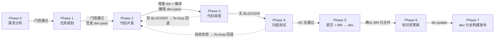
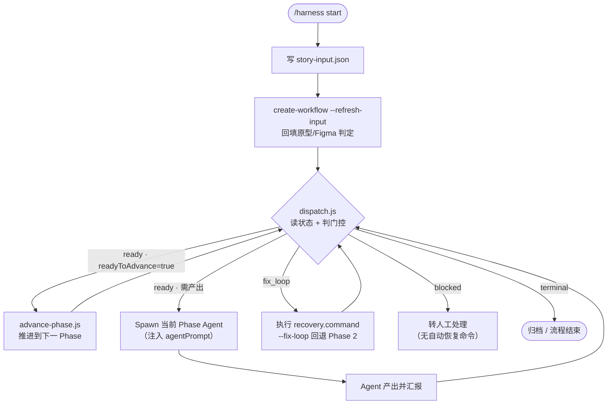

# Harness Marketplace

**端到端 AI 开发自动化工作流插件市场。**

通过安装 **Harness** 插件，为你的 AI 编程助手（Claude Code / CodeBuddy Code）接入一条覆盖「Bug 分析 → 需求分析 → 任务规划 → 代码开发 → 代码审查 → 功能测试 → Git 提交 → 知识库更新 → 云端部署」全流程的自动化开发流水线，并配套知识库（KB）管理、文档生成、API 生成、Figma 设计稿协作等能力。

> **兼容 Claude Code 与 CodeBuddy Code**
> 两款工具使用相同的 `/plugin` 命令体系，安装步骤完全一致。
> 市场清单分别位于 `.claude-plugin/marketplace.json`（Claude Code）与 `.codebuddy-plugin/marketplace.json`（CodeBuddy Code），内容一致。

> **安装源（GitHub）**：`https://github.com/JayCJP/harnessflow.git`

---

## 目录

- [核心特性](#核心特性)
- [环境要求](#环境要求)
- [安装](#安装)
- [快速上手](#快速上手)
- [常用命令](#常用命令)
- [最佳实践](#最佳实践)
- [插件配置](#插件配置)
- [故障排除与卸载](#故障排除与卸载)
- [仓库结构](#仓库结构)

---

## 核心特性

### 1. 端到端 8 Phase 工作流

一条命令驱动完整研发链路，每个 Phase 有明确的 Agent 分工、产出物与门控校验：

| Phase | 阶段 | 负责 Agent | 关键产出物 |
|-------|------|-----------|-----------|
| 0 | 需求分析 | 需求分析师 | requirement-analysis.md、acceptance-criteria.json |
| 1 | 任务规划 | 任务规划师 | task-dag.md / task-dag.json（可并行任务 DAG） |
| 2 | 代码开发 | 前端开发工程师 | 代码变更（dev-pass 限域保护） |
| 3 | 代码审查 | 代码审查师 | code-review.json |
| 4 | 功能测试 | 测试工程师 | test-report.md、acceptance-verification.json |
| 5 | Git 提交 + MR | 发布助手 | 提交开发分支 + 创建 MR（→ dev）+ 确认已合并 |
| 6 | 知识库更新 | 发布助手 | 增量知识库文档（kb-update） |
| 7 | 云端部署 | 发布助手 | dev 分支构建（env=dev, build_other=dev）+ 部署 URL |

#### 8 Phase 横向流转



#### 主控循环（dispatch.js 四态调度）



> **核心设计：AI 不操作状态，只机械执行。**
> `dispatch.js` 是「只读调度器」——读状态、判门控、说下一步，零写权限；
> `advance-phase.js` 是「相位跃迁唯一执行者」——判门控、写状态、签发/撤销 dev-pass；
> 主 Agent 无判断权，只按 `status` 四态（ready / fix_loop / blocked / terminal）机械分支。

### 2. 契约驱动 + 硬门控

工作流不是「口头约定」，而是**结构化契约 + 程序化门控**：

- 每个 Phase 推进前，`policy.js` 校验上一 Phase 产出物是否完整、格式是否符合 schema
- 验收标准（AC）与任务（Task）交叉引用校验，杜绝「AC 全绿但功能缺失」
- Phase 2→3 自动跑**增量 ESLint + 本地编译**，编译错误不再漏到云端构建才暴露

### 3. 权限控制（dev-pass）

AI 修改 `src/` 代码受 dev-pass 通行证约束，仅在开发阶段由脚本自动签发、限域到任务清单，阶段结束自动撤销 —— 杜绝 AI 越权改动未授权文件。

### 4. 知识库（KB）管理

- `kb-init` 初始化项目知识库（自动推断项目画像与业务域）
- `kb-query` 分层检索（需求分析/改代码前自动注入历史教训）
- `kb-update` 增量更新（任务完成后自动同步，保留手工批注）

### 5. Figma 设计稿协作

- 提供 Figma 链接即自动开启设计稿硬门控，强制 100% 还原
- `figma-to-component-map` 产出 frame 清单与组件映射，零猜测对齐

---

## 环境要求

- 已安装 **Claude Code** 或 **CodeBuddy Code**（两者任一即可）
- 可访问 GitHub 仓库：`https://github.com/JayCJP/harnessflow.git`
- **无需 `npm install`**：插件的 JSON Schema 校验依赖（ajv）已单文件内置

### 前置 MCP 服务配置

插件市场本身**不携带**外部 MCP 服务，以下 MCP 需你在工具（Claude Code / CodeBuddy Code）中自行配置。**按需启用**——只装你实际会用到的能力对应的 MCP：

| MCP 服务 | 使用场景 | 用到它的 Agent / Skill | 必需程度 |
|---------|---------|----------------------|---------|
| **TAPD MCP** | Bug 分析、缺陷修复、需求详情拉取 | 需求分析师（fixbugs）、`tapd-bug-analyzer` | fixbugs 模式必需 |
| **Figma MCP** | 设计稿读取、frame 清单、组件映射 | 需求分析师、前端开发工程师、`figma` / `figma-to-component-map` | 有 Figma 设计稿时必需 |
| **Playwright MCP** | 原型抓取（墨刀/Axure）、UI 自动化测试、接口验证 | 需求分析师（原型）、测试工程师（验证） | 有原型链接 / 需 UI 测试时必需 |
| **GitLab MCP** | 创建 Merge Request | 发布助手（②创建 MR） | 需走 MR 流程时必需 |
| **DevOps MCP** | 云端构建、部署 | 发布助手（⑤构建发布） | 需云端部署时必需 |
| **Sequential Thinking MCP** | 任务拆解时的结构化推理 | 任务规划师 | 建议启用 |

> **提示**：以上 MCP 服务名（如 `TAPD_MCP_Server`、`Figma_MCP`、`Playwright`、`GitLab`、`Devops`、`Sequential_Thinking`）需与工具配置中的 MCP 名称一致，Agent 通过 `mcp_call_tool(serverName, ...)` 调用。
> 未配置对应 MCP 时，涉及该能力的环节会失败并如实告知，不会静默跳过。

---

## 安装

安装分三步：**添加市场 → 安装插件 → 重载**。

### 第 1 步：添加市场

```bash
/plugin marketplace add https://github.com/JayCJP/harnessflow.git
```

> 已配置 GitHub SSH 密钥时，可用 SSH 方式：
> ```bash
> /plugin marketplace add git@github.com:JayCJP/harnessflow.git
> ```

添加成功后市场名为 **`harness-marketplace`**。

### 第 2 步：安装插件

```bash
/plugin install harness@harness-marketplace
```

安装时选择作用域：
- **用户作用域**（默认）：对本机所有项目生效
- **项目作用域**：仅当前仓库（写入 `.codebuddy/settings.json`，随仓库分发）
- **本地作用域**：仅本人当前仓库

### 第 3 步：重载生效

```bash
/plugin list
```

确认列表包含 `harness` 插件即安装成功。

> **AI 代理 / 详细排障请参阅 [INSTALL.md](./INSTALL.md)**，含安装前检查、冒烟测试、ajv 依赖排查等完整步骤。

---

## 快速上手

### 场景 A：新功能开发

```bash
/harness start STORY-001 "1v1客服等级分配模式"
```

然后在 `.codebuddy/plans/STORY-001/story-input.json` 写入原始输入：

```json
{
  "mode": "run",
  "storyId": "STORY-001",
  "title": "1v1客服等级分配模式",
  "sources": {
    "prototypeUrls": ["https://proto.example.com/xxx"],
    "figmaUrls": ["https://www.figma.com/design/AbC123/订单中心?node-id=12-345"],
    "terminal": "H5",
    "text": "补充说明"
  }
}
```

写完后回填判定（必做，否则原型/Figma 门控不生效）：

```bash
node <插件安装路径>/plugins/harness/scripts/commands/create-workflow.js STORY-001 --refresh-input
```

之后工作流由主控 Agent 自动调度，逐 Phase 推进直至部署。

### 场景 B：Bug 修复

```bash
/harness fixbugs <storyId> "<标题>"
```

Bug 修复模式免原型文档要求，Phase 0 需求分析师会自动拉取 TAPD 缺陷并产出 Bug 分析报告。

---

## 常用命令

| 命令 | 说明 |
| --- | --- |
| `/harness run` | 执行端到端开发工作流（8 Phase 全流程） |
| `/harness fixbugs` | 针对缺陷做根因分析并自动修复（免原型文档） |
| `/harness evolve` | 触发插件自进化体检（audit → 度量 → 诊断 → 治疗 → 验证） |
| `/harness archive` | 归档已完成的迭代 / 任务 |

---

## 最佳实践

### 1. 工作流初始化

- **`start` 之后必须写 `story-input.json`，并执行 `--refresh-input`**。
  漏掉回填会导致两类问题：无原型的纯文字需求被卡在「必须产出 prototype-analysis.md」；有 Figma 的需求完全不会触发设计稿门控。
- **`story-input.json` 只搬运参数、不做分析**。主 Agent 原样写入用户给的链接/终端/描述，分析归 Phase 0 需求分析师，避免跨 Agent 传递丢失中间推理。

### 2. 状态文件纪律（铁律）

- 🚫 **AI 不手改 `e2e-state.json` / `dev-pass.json`**。Phase 推进、dev-pass 签发/撤销全部由脚本完成，AI 只执行 `dispatch.js` / `advance-phase.js` 给出的指令。
- 🚫 **AI 不自行将 `open-questions.json` 的 `resolved` 设为 `true`**。待确认项必须由用户确认。
- 🚫 **Phase ≠ 2 时不要编辑 `src/`**，Hook 守卫会直接拒绝。

### 3. Figma 使用

- 给 `sources.figmaUrls` 即**自动开启硬门控**（run 模式），强制产出 `figma-frame-inventory.json` 与 `figma-component-map.md`，task 的 `figmaNodeId` 必须命中 frame 清单。
- **前置条件：Figma 桌面端需运行并已打开文件**。未运行时子 Agent 会如实告知并停止，不会退回缓存数据 —— 这是「零猜测还原」的保障。
- `fixbugs` 模式不开硬门控（只碰个别页面，全量清单会卡死修复流程），但「有设计稿就该解析」的指引仍会注入。

### 4. run vs fixbugs 模式选择

- **新功能 / 页面级改造** → `run`（有原型/Figma 门控、featurePoints 功能点枚举）
- **缺陷修复** → `fixbugs`（免原型文档、Phase 0 产出 Bug 分析报告、后端类 Bug 自动转 open-questions）
- 选错模式的后果：`fixbugs` 漏加 `--mode=fixbugs` 会退回 run，重新要求原型文档且不做 Bug 报告门控。

### 5. 修复回路（fix-loop）

- 审查/测试发现 BLOCKER 或验收失败时，工作流自动回退到 Phase 2 修复，重新签发限域 dev-pass。
- **默认最多 2 轮**，超出后转人工介入。不要让 AI 无限重试空转。

### 6. 知识库（KB）

- 新项目先 `kb-init` 初始化知识库骨架（自动推断项目画像与业务域）。
- 需求分析/改代码前用 `kb-query` 分层检索，历史教训会自动注入各 Phase 的 prompt。
- 任务完成后 `kb-update` 增量同步，保留手工批注，避免每次全量重写。

### 7. 多项目协作

- 涉及多仓库时，需求分析师在 Phase 0 写入 story 级 `repos.json`（`primary` + `repos` 映射）。
- 跨项目 task 的 `description` 必须含行号引用，便于开发工程师定位改动点。

---

## 插件配置

安装后在 `/plugin` 界面可修改：

| 配置项 | 类型 | 说明 | 默认值 |
| --- | --- | --- | --- |
| `workspaceRoot` | string | 默认工作区根目录 | `D:/workfile` |

---

## 故障排除与卸载

### 卸载

```bash
/plugin uninstall harness@harness-marketplace
/plugin marketplace remove harness-marketplace   # 会同时卸载该市场下所有插件
```

### 常见问题

| 问题 | 解决方法 |
| --- | --- |
| 市场添加后无法加载 | 确认 GitHub 地址可访问，仓库根目录存在 `.codebuddy-plugin/marketplace.json` |
| 安装时提示「路径未找到」 | 使用 Git 型市场（`https://...git`），不要用 URL 型 |
| 命令 / 技能不显示 | `/reload-plugins` 重载，或删除缓存 `rm -rf ~/.codebuddy/plugins/cache` 后重启重装 |
| 报 `Cannot find module 'ajv'` | 确认 `plugins/harness/vendor/ajv.bundle.js` 存在，`git pull` 同步（不要 `npm install`） |
| 需要调试日志 | 启动工具时加 `--debug` 参数 |

> 更多排障细节见 [INSTALL.md](./INSTALL.md)。

---

## 仓库结构

```
harness-marketplace/
├── .codebuddy-plugin/marketplace.json   # CodeBuddy Code 市场清单
├── .claude-plugin/marketplace.json      # Claude Code 市场清单（内容一致）
└── plugins/
    └── harness/                          # Harness 插件本体
        ├── plugin.json                   # 插件元信息（agents/skills/hooks 入口）
        ├── agents/                       # 6 个工程角色代理
        ├── skills/                       # 工作流 / 编排 / 知识库 / 文档 / 接口 / Figma 技能
        ├── hooks/                        # 阶段钩子（dev-pass / 状态文件守卫）
        ├── rules/                        # 知识库自动检索规则
        ├── scripts/                      # audit / services / schemas / commands
        ├── vendor/ajv.bundle.js          # 内置 ajv 单文件（免 npm install）
        └── output-styles/
```
